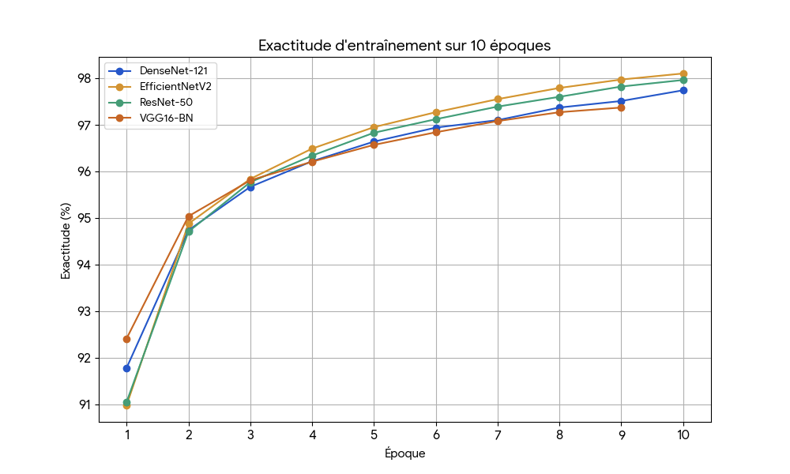

# Claris: Histopathology Cancer Detector

This project was realized for Expo-Science hosted by Hydro-Quebec.

## Introduction

Many healthcare professionals are under great pressure with the current situation of Quebec's healthcare industry. A severe lack of personnel is a prominent issue, and the efficiency in cancer diagnosis process was worsened by this problem. It is not always easy to detect cancer in images. This project aims to develop a deep learning model that can detect histopathologic cancer in images, in order to ease the process of detection and pressure on the healthcare industry.

---

## Dataset

https://www.kaggle.com/competitions/histopathologic-cancer-detection/data 

This dataset of histopathologic scans of lymph node sections is a modified version of the PCAM (PatchCamelyon) dataset.

> 
    The PatchCamelyon benchmark (PCAM) consists of 327.680 color images (96 x 96px) extracted from histopathologic scans of lymph node sections. Each image is annoted with a binary label indicating presence of metastatic tissue.
    Fundamental machine learning advancements are predominantly evaluated on straight-forward natural-image classification datasets and medical imaging is becoming one of the major applications of ML and thus deserves a spot on the list of go-to ML datasets. Both to challenge future work, and to steer developments into directions that are beneficial for this domain.

## Model

The model used in this project is DenseNet-121, a type of Convolutional Neural Network (CNN) for precision purposes. The CNN is trained on the dataset using the categorical cross-entropy loss function. The model will be able to classify the images into one of the following categories: benign or malignant.

## Implementation

The implementation of the model is done with Jupyter Notebook using the Pytorch library. The model is trained on Kaggle duo-T4 GPU using the Adam optimizer. 
  
## Accuracy
The model achieved a peak accuracy of around 97.5% after 6 epochs.

## Sources
Thanks to many Kaggle competitions, datasets and notebooks for inspiration.