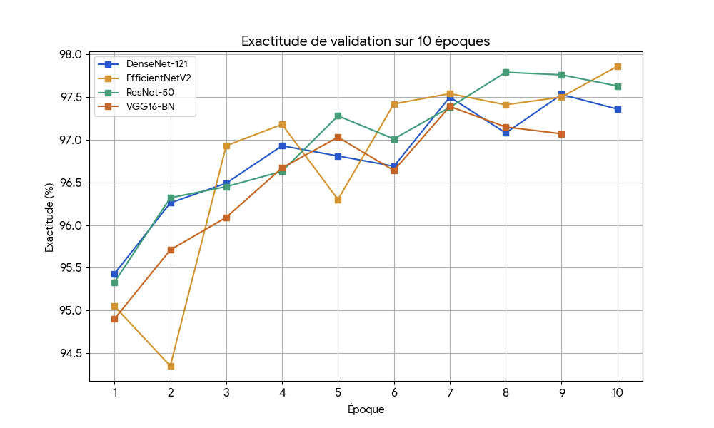

# Claris: Histopathology Cancer Detector

This project was realized for Expo-Sciences hosted by Hydro-Quebec.

## Introduction

Many healthcare professionals are under great pressure with the current situation of Canadian healthcare industry. A severe lack of personnel is a prominent issue, and the efficiency in cancer diagnosis process is worsened by this problem. It is not always easy to detect cancer in images. This project aims to develop a deep learning model that can detect histopathologic cancer in images, in order to ease the process of detection and pressure on the healthcare industry.

---

## Dataset

https://www.kaggle.com/competitions/histopathologic-cancer-detection/data 

This dataset of histopathologic scans of lymph node sections is a modified version of the PCAM (PatchCamelyon) dataset.

> 
    The PatchCamelyon benchmark (PCAM) consists of 327.680 color images (96 x 96px) extracted from histopathologic scans of lymph node sections. Each image is annoted with a binary label indicating presence of metastatic tissue.
    Fundamental machine learning advancements are predominantly evaluated on straight-forward natural-image classification datasets and medical imaging is becoming one of the major applications of ML and thus deserves a spot on the list of go-to ML datasets. Both to challenge future work, and to steer developments into directions that are beneficial for this domain.

## Model

The models tested in this project are DenseNet-121, ResNet-50, EfficientNetV2 (L) and VGG16-BN, all architectures of Convolutional Neural Network (CNN) that excel in precision. They are all pre-trained on the ImageNetV1 dataset using transfer learning. The output layer of the model consists of two neurons: benign or malignant.

## Implementation

This implementation utilizes PyTorch. The model is trained on Kaggle duo-T4 GPU.
  
## Accuracy
On an average of 15 epochs, here are the results of the model:
- ResNet-50: 97.29%
- DenseNet-121: 97.24%
- EfficientNetV2-L: 97.37%
- VGG16-BN: 97.04%

 
Inference speed (ranked):
 
1. ResNet-50  
2. VGG16-BN  
3. DenseNet-121  
4. EfficientNetV2-L  
 

## Sources
Thanks to many Kaggle competitions, datasets and notebooks for inspiration.  
Mainly:
[PCam Dataset (modified)](https://www.kaggle.com/competitions/histopathologic-cancer-detection/data)  
[Original inspiration](https://www.kaggle.com/code/akarshu121/cancer-detection-with-cnn-for-beginners)